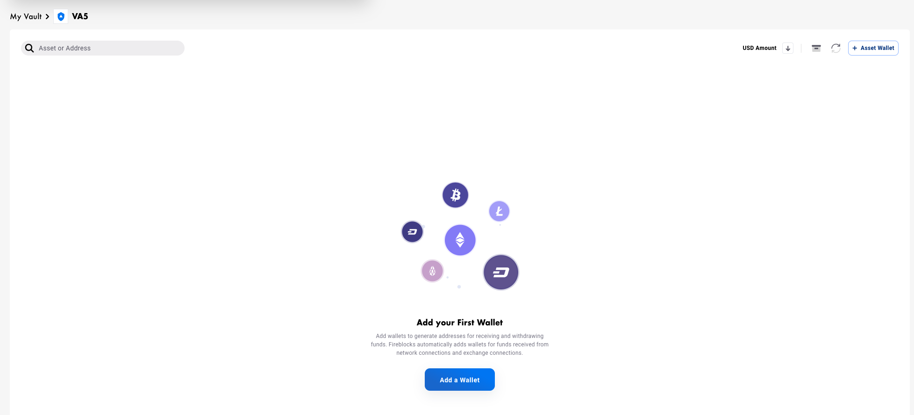
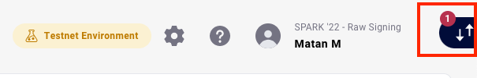

# Raw Signing Lab - Advance

## Target Demography
Customers who are looking to use more advanced features of currently supported assets or add custom support for unsupported assets.

## Description
Raw signing is a mechanism which allows users to sign a payload of their choice. The usage of raw signing is complex and requires high technical proficiency but can help perform operations which are not yet supported natively on the Fireblocks platform.
Such operations might be staking, custom blockchain features (for example Stellar’s clawback functionality) or adding private support for unsupported assets (in this lab we will perform transfers using the unsupported Zenith asset).

## Lab Prerequisites
- Review the [security advisory](./README.md#span-stylecolorredsecurity-advisoryspan)
- Intermediate Python knowledge
- [Python](https://www.python.org/downloads/)
- [Pycharm CE](https://www.jetbrains.com/pycharm/download/#section=mac)
- The following dependencies should be [installed on pycharm](https://www.jetbrains.com/help/pycharm/installing-uninstalling-and-upgrading-packages.html) (after creating a new project):
    - web3
    - fireblocks-sdk
    - hexbytes
    - eth-account
    - pycryptodome

## Lab Steps

## **Section 1 - Setup**

**NOTE:**
If you have created a designated Vault Account in the previous lab exercise, please use it, and skip to step 4.
 
1. Create a new Vault Account with Eth_Test wallet:
    On the Workspace > Accounts tab, click  and type in the name “VA\<your group number\>”.

    Result:<br>
    Your newly created Vault Account appears:<br>
    

2. Create an instance of Fireblocks SDK: Follow this [documentation](https://docs.fireblocks.com/api/#getting-started).

3. Get the public key to compute your source address:

    **NOTE:**
    You will generate a public key to be used as your address.

    Use a derivation path to get your public key - the derivation path structure is an array of numbers as follows ([Fireblocks HC Article](https://support.fireblocks.io/hc/en-us/articles/360014330819-Fireblocks-Vault-HD-Derivation-Paths)):<br>
    `[44, 765, VAULT-ID, 0, 0]`

    **NOTE:**
    Coin ID can be found in this [github](https://github.com/satoshilabs/slips/blob/master/slip-0044.md) reference, however as Zenith does not have a coin Id in this table, we will use an unassigned ID 765.

    Now you will obtain the public key using the derivation path above.

    Example:
    ```
    derPath = "[44,765,"+src_vault_id+",0,0]"
    pubkey =  fbks.get_public_key_info(algorithm=MPC_ECDSA_SECP256K1, derivation_path=derPath, compressed=False)
    ```

4. Calculate your address based off your public key:

    Since Zenith is an EVM based blockchain, deriving the address from the public key is done as shown below. For non-EVM, the address should be calculated according to the blockchain's specifications.
    
    Example:
    ```
    keccak = keccak.new(digest_bits=256)
    keccak.update(bytes.fromhex(pubkey['publicKey'][2:]))
    srcAddr = '0x' + keccak.hexdigest()[-40:]
    srcAddr = Web3.toChecksumAddress(srcAddr)
    ```

    Repeat this step with the derivation path: [44,765,0,0,0], this will be the destination address of our transaction (store the resulting address in a different variable).

5. Construct web3 instance:
    Use the [default builder](https://web3py.readthedocs.io/en/stable/quickstart.html#remote-providers) and the RPC endpoint for [zenith testnet](https://chainlist.org/chain/81).

    Example:
    ```
    from web3 import Web3
    from web3.gas_strategies.rpc import rpc_gas_price_strategy
    ...
    web3 = Web3(Web3.HTTPProvider('https://vilnius.zenithchain.co/http'))
    ```

6. Obtain the Zenith testnet token, send it to your calculated address (the source address calculated before):<br>
    Copy and paste your source address to the [faucet](https://faucet.zenithchain.co/).

    **NOTE:**<br>
    There is a queue to get tokens, and one is generated every minute, so it might take a few minutes to get a token. 

7. Verify receiving the Zenith token<br>
    Check the balance of the source and destination addresses you’ve created. The variable `dstAddr` is the second address created in step 4.

    Example:
    ```
    srcBalance = web3.fromWei(web3.eth.get_balance(srcAddr), 'Ether')
    dstBalance = web3.fromWei(web3.eth.get_balance(dstAddr), 'Ether')
    print("Source: " + str(srcBalance) + ", Destination: " + str(dstBalance))
    ```

## **Section 2 - Generating the transaction**

1. Construct a Web3 Transaction:<br>
    As part of this you get the gas price and reduce the expected fee from our transaction value, as follows: 

    ```
    from web3.gas_strategies.rpc import rpc_gas_price_strategy
    ...
    balance = web3.eth.getBalance(<src addr>)
    nonce = web3.eth.getTransactionCount(<src addr>)
    tx = {
        'to': <dst addr>,
        'value': web3.toWei(float(balance), 'Ether'),
        'gas': 21000,
        'nonce': nonce,
        'chainId': 81
    }
    # Get the gas price for the transaction
    web3.eth.set_gas_price_strategy(rpc_gas_price_strategy)
    gasPrice = web3.eth.generate_gas_price(tx)
    tx['gasPrice'] = gasPrice
    tx['value'] = tx['value'] - (21000 * gasPrice)
    ...
    ```

2. Obtain the hash to sign: 
	Example:
    ```
    from eth_account._utils.legacy_transactions import (serializable_unsigned_transaction_from_dict)
    ...
    unsignedTx = serializable_unsigned_transaction_from_dict(tx)
    msgToSign = unsignedTx.hash()
    ...
    ```

3. Sign the raw transaction
    Reference:  [documentation](https://docs.fireblocks.com/api/#create-a-new-transaction)

    Sign the raw transaction with the parameters:
    * **tx_type**:<br>
	`TransactionOperation.RAW `

    * **extraParameters**:<br>
    The structure should be the same as the [documentation](https://docs.fireblocks.com/api/#create-a-new-transaction:~:text=will%20be%20rejected-,extraParameters,-JSON%20object) ([rawMessageData](https://docs.fireblocks.com/api/#rawmessagedata)), note that in this scenario we will need to provide both the derivation path as well as the algorithm to use for signing:
        * Content - should be `msgToSign.hex()[2:]` - this will convert the value of `msgToSign` to a hex value and remove the '0x' prefix.
        * Derivation path - derivation path used for the source address (a **list** of ints):<br>
        `[44, 765, src_vault_id, 0, 0]`
        * Algorithm - same as used previously: `MPC_ECDSA_SECP256K1`

    Result:<br>
    The operation returns a [CreateTransactionResponse](https://docs.fireblocks.com/api/#createtransactionresponse) object.

4. Get the transaction id:<br>
    Get the transaction id (id) parameter from the CreateTransactionResponse object.

5. Get the transaction status:<br>
    * [Query the transaction status](https://docs.fireblocks.com/api/#retrieve-a-specific-transaction) according to the transaction id value.
    Result: The returned object is [TransactionDetails](https://docs.fireblocks.com/api/#transactiondetails).

    * Get the status (status) parameter from the returned object. 
    As long as the status is not one of: `CANCELLED, FAILED, BLOCKED, REJECTED, COMPLETED`
    Continue to query the transaction, with a 5 second delay between queries.


6. Get the signature for the signed transaction:<br>
    Once the status is `COMPLETED`, get the first element of the Signed Messages (signedMessages parameter) array - this will be the signature used for the transaction.

    Example:<br>
    `sig = fbksTx["signedMessage"][0]["signature"] `

7. Construct a signed transaction with the signature:<br>

    ```
    from eth_utils.curried import (keccak)
    from eth_account._utils.legacy_transactions import (encode_transaction)
    from eth_account.datastructures import SignedTransaction
    from hexbytes import HexBytes
    ...
    fbksTx = fbks.get_transaction_by_id(txId)
    sig = fbksTx["signedMessage"][0]["signature"]
    sig["v"] = sig["v"] + 35 + (81 * 2) # EIP-155
    encodedTx = encode_transaction(
        unsignedTx, 
        vrs=(
            sig["v"], 
            int(sig["r"], 16), 
            int(sig["s"], 16)
        )
    )
    keccak = keccak.new(digest_bits=256)
    keccak.update(encodedTx)
    signedTx = SignedTransaction(
        rawTransaction=HexBytes(encodedTx), 
        hash=HexBytes(keccak.digest()), 
        r=int(sig["r"], 16),
        s=int(sig["s"], 16), 
        v=sig["v"]
    )
    ```

8. Find the balance of the addresses
    Use web3 to [find the balance](https://web3py.readthedocs.io/en/latest/web3.eth.html?highlight=getbalance#web3.eth.Eth.getBalance) of the Source and Destination addresses and print it out to the screen.

    Example:
    ```
    srcBalance = web3.fromWei(web3.eth.get_balance(srcAddr), 'Ether')
    dstBalance = web3.fromWei(web3.eth.get_balance(dstAddr), 'Ether')
    print("Source: " + str(srcBalance) + ", Destination: " + str(dstBalance))
    ```

9. Broadcast the signed transaction to the network:<br>
    Once obtaining the signed transaction, broadcast it to the network using the web3 we created.

    Example:
    ```
    transmittedTxHash = web3.eth.sendRawTransaction(signedTx.rawTransaction)
    print("Tx Hash: " + str(transmittedTxHash.hex()))
    ```

10. Get new balance of the addresses:<br>
    After a few minutes, print the updated balances to see the changes.<br>
    Reference: [documentation](https://web3py.readthedocs.io/en/latest/web3.eth.html?highlight=getbalance#web3.eth.Eth.getBalance) 

    Example:
    ```
    srcBalance = web3.fromWei(web3.eth.get_balance(srcAddr), 'Ether')
    dstBalance = web3.fromWei(web3.eth.get_balance(dstAddr), 'Ether')
    print("Source: " + str(srcBalance) + ", Destination: " + str(dstBalance))
    ```

    Result:<br>
    On the Workspace, a notification appears on the Active Transfer Panel.<br>
    
