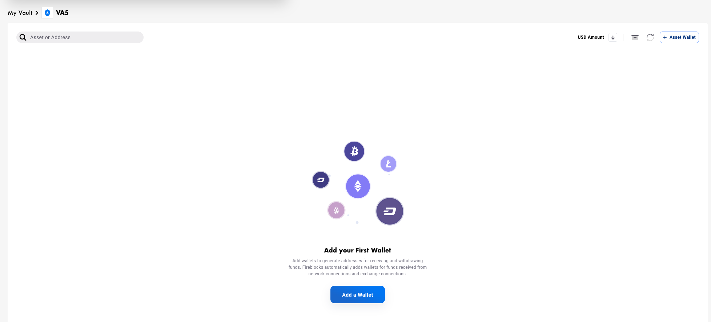

# Raw Signing Lab - Basic

## Target Demography
Customers who are looking to understand how to implement proof of ownership or how to perform signatures in [EIP-712](https://eips.ethereum.org/EIPS/eip-712).

## Description
Proof of ownership is an intrinsic part of many aspects of cryptocurrency operations, from proving you’re the owner of a wallet for your DApps (DeFi Apps), to providing ownership of funds to regulators.<br>
Simple proof of ownership is a solved issue if all we care about is some sample byte string, what about more complex messages? Ones that actually have data?<bt>
For that purpose EIP-712 was created along with a new scheme to allow the signing of a complex data structure which can provide the user with actual useful information.<br>
EIP-712 provides a guide on hashing and signing typed data structures, wherein the user will be presented with a pre-hashed message that is easy to decipher and readable to the user.<br>
Examples of usages for either operation are:
1. Proof of wallet ownership to a third party, or regulator
2. Signing gasless transactions
3. Getting signatures for key derivation (StarkEx for example)

This lab will cover how Fireblocks’ API allows you to perform a simple proof of ownership signature, as well as a more complex EIP-712 signature.<br>

## Lab Prerequisites
* Google drive [link](https://bit.ly/3ew8fnl)
* Review the [security advisory](./README.md#span-stylecolorredsecurity-advisoryspan)
* Basic Javascript knowledge
* [NodeJS](https://nodejs.org/en/download/) 
* [Visual Studio code](https://code.visualstudio.com/)
* The following modules:
    * [js-sha256](https://www.npmjs.com/package/js-sha256)
    * [fireblocks-sdk](https://www.npmjs.com/package/fireblocks-sdk)
* [Code reference](/examples/basic.js)

## Lab Steps
1. Create a new Vault Account with Eth_Test wallet:
    On the Workspace > Accounts tab, click  and type in the name “VA\<your group number\>”
    Result: The newly created Vault Account appears:
    
    
    
2. In the Vault Account, click  and create an ETH_TEST wallet.
    Result: The newly created Asset Wallet appears:
    

3. Create an instance of Fireblocks SDK: Follow this [documentation](https://docs.fireblocks.com/api/#getting-started).

4. Initiate a transaction using the API:
    Reference: [Create a New Transaction](https://docs.fireblocks.com/api/#create-a-new-transaction) from the API Developer Guide.

    In case you are implementing an EIP712 message signing:<br>
    Please include this constant in your code as it will be used later.<br>
    EIP-712 is provided not as a bytestring but rather as a complex data structure; the following constant is the data structure. More inforamtion can be read from the link at the top of the basic lab description. Comments within the code explain what each object / key is responsible for.
    ```
    const eip_message = {
    "types": { // Each type defines an object and each object contains definitions of internal fields and their corresponding data type
        "example_eip712": [ // Our example eip712 type only has a single field called value of type string
            {
                "name": "value",
                "type": "string"
            }
        ],
        "EIP712Domain": [ // EIP712 Domain, predefined according to the EIP specification
            {
                "name": "name",
                "type": "string"
            },
            {
                "name": "version",
                "type": "string"
            },
            {
                "name": "chainId",
                "type": "uint256"
            }
        ]
    },
    "domain": { // The domain, in the above type EIP712Domain
        "name": "example_eip712",
        "chainId": 1,
        "version": "1.0"
    },
    "message": { // The message to sign. This message is of the same type as specified in "primaryType" below, in our case example_eip712
        "value": "test 123123"
    },
    "primaryType": "example_eip712" // The type of the message that we want to sign
    };
    ```

    Use the following parameters:<br>
    **assetId** (Only ETH types can be used):<br>
	`ETH_TEST`


    **source**: <br>
    **id** - 
    When in your Vault Account take the VA number from the URL (see example VA ‘5’ below):
    

    Example:
    ```
    source: {
            type: PeerType.VAULT_ACCOUNT,
            id: '5'
    }
    ```

    **operation**:<br>
	`TransactionOperation.TYPED_MESSAGE`

    **extraParameters**:<br>
    The structure should be the same as the [documentation](https://docs.fireblocks.com/api/#create-a-new-transaction:~:text=will%20be%20rejected-,extraParameters,-JSON%20object) ([rawMessageData](https://docs.fireblocks.com/api/#rawmessagedata)), however the message to be signed should be structured as follows:
content:<br>
    * For Proof of ownership:
        Insert the hex representation of the message to be signed:<br>
        `content: Buffer.from('message to sign goes here').toString('hex')`<br><br>
        For EIP712 - we will be using the custom object created before:<br>
        `content: eip_message`

    * Index: 0
    * type: 
    For Proof of ownership: ETH_MESSAGE
    For EIP712:  EIP712

5. Get the transaction ID parameter:<br>
    The operation returns a [CreateTransactionResponse](https://docs.fireblocks.com/api/#createtransactionresponse) object. Get the transaction id (id) parameter.

    Example:<br>
    `const {id} = await fbks.createTransaction({...});`

6. Get the Status parameter from the transaction details:<br>
    [Query the transaction status](https://docs.fireblocks.com/api/#retrieve-a-specific-transaction) according to the transaction id parameter.<br>
    The returned object is [TransactionDetails](https://docs.fireblocks.com/api/#transactiondetails), get the status (status) parameter from the returned object.<br>
    As long as the status is not one of: `CANCELLED, FAILED, BLOCKED, REJECTED, COMPLETED` <br>
    Continue to query the transaction, with a 5 second delay between queries.


7. Print the signed message:<br>
    Once the status is `COMPLETED`, print the entire Signed Messages (signedMessages) parameter array using [inspect](https://nodejs.org/api/util.html#utilinspectobject-showhidden-depth-colors).

    Example:<br>
    `inspect(obj,false,null,true)`

    Result:<br>
    On the Workspace, a notification appears on the Active Transfer Panel:<br>
    


8. Check the Raw Message status:

    * On the Workspace, click the Active Transfer Panel
    * Click the Raw Message to see more information.

        For EIP712, in “Raw Message Content” you can see the EIP message content:<br>
    


9. Recover the Address from the Signature (Ownership Verification Process):
This step is provided for completeness, this would usually be done by the counterparty in order to verify that the provided signature really came from the wallet \ address that you are claiming ownership over.<br>

    * Go to: https://toolkit.abdk.consulting/ethereum#recover-address
    * Under Recover Address select Hash radio button
    * From the output that you printed in the previous step, copy the value of the two following parameters:

        * `content`
        * `fullsig`

    ‘content’ and ‘fullsig’ parameters should be prefixed with “0x” and inserted into the “Hash”  and the “Signature” fields on the site accordingly.<br>
    Append to the end of ‘fullsig’ the value of the ‘v’ argument (from the previous step):<br>
        * If it is 0, append “00” to the end of the signature field<br>
        * If it is 1, append “01” to the end of the signature field.<br>

    Example:<br>
    *Console output*:
    ```
    Signed Message: [{
        derivationPath: [ 44, 1, 1, 0, 0 ],
        algorithm: 'MPC_ECDSA_SECP256K1',
        publicKey: '03e8973469db0f7cb7b72c8b217e0c9dc5e90c5a1ac17a3d8c96ff5963ad86cb4e',
        signature: {
        fullSig: '9d08361831fd817bde2f74aaeb94c89840584150e75dce089242cd1719634d745f0682858e6e12a32f3374057758d5f99ca7b1691990088c75b28e6821dc3d12',
        r: '9d08361831fd817bde2f74aaeb94c89840584150e75dce089242cd1719634d74',
        s: '5f0682858e6e12a32f3374057758d5f99ca7b1691990088c75b28e6821dc3d12',
        v: 0
        },
        content: '4a5c5d454721bbbb25540c3317521e71c373ae36458f960d2ad46ef088110e95'
    }]
    ```

    *Recover Address*:
    