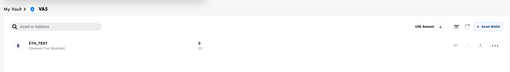
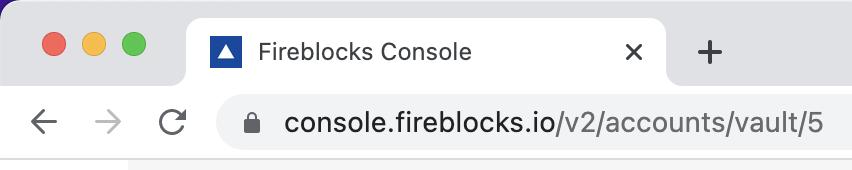
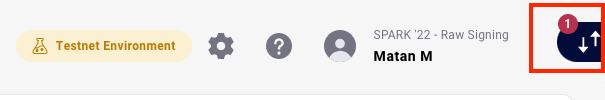
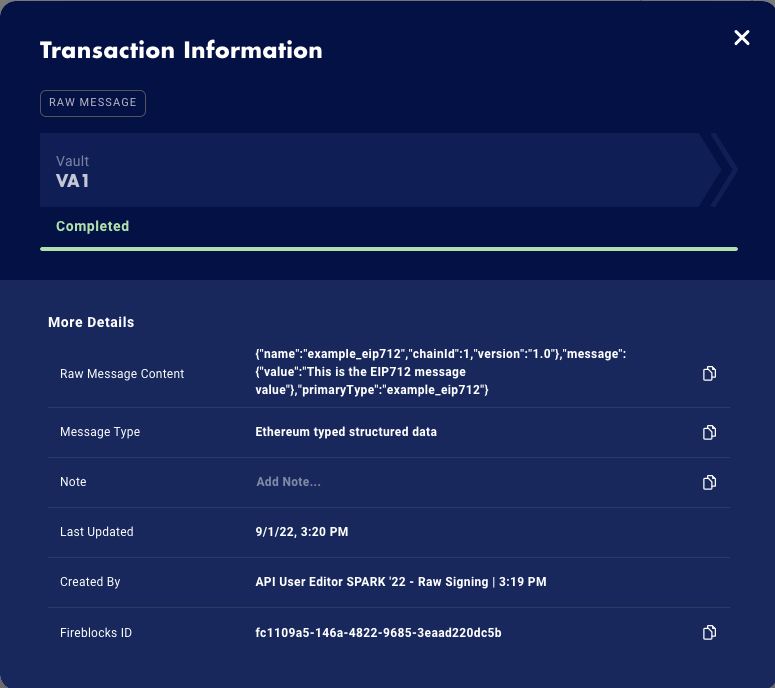

# SPARK'22 - Raw Signing Lab

## Overview
In this lab we will cover two main topics:
1. Proof of ownership - Standard Message signing and EIP712 signing
2. Adding support for an unsupported blockchain

This lab require at least basic coding skills with either python or javascript.<br>
Each lab is written in a diffrent programming language, however it is possible to write the code in a different programming language, the recommendation is to stick with python or javascript.<br>

Table of contents:
1. [Basic Lab](#raw-signing-lab---basic)
2. [Advance Lab](#raw-signing-lab---advance)


## Raw Signing Lab - Basic

### Target Demography
Customers who are looking to understand how to implement proof of ownership or how to perform signatures in [EIP-712](https://eips.ethereum.org/EIPS/eip-712).

### Description
Proof of ownership is an intrinsic part of many aspects of cryptocurrency operations, from proving you’re the owner of a wallet for your DApps (DeFi Apps), to providing ownership of funds to regulators.<br>
Simple proof of ownership is a solved issue if all we care about is some sample byte string, what about more complex messages? Ones that actually have data?<bt>
For that purpose EIP-712 was created along with a new scheme to allow the signing of a complex data structure which can provide the user with actual useful information.<br>
EIP-712 provides a guide on hashing and signing typed data structures, wherein the user will be presented with a pre-hashed message that is easy to decipher and readable to the user.<br>
Examples of usages for either operation are:
1. Proof of wallet ownership to a third party, or regulator
2. Signing gas-less transactions
3. Getting signatures for key derivation (StarkEx for example)

This lab will cover how Fireblocks’ API allows you to perform a simple proof of ownership signature, as well as a more complex EIP-712 signature.<br>

### <span style="color:red">Important Security Note:</span>
Raw signing allows users to sign any arbitrary message. This feature is highly insecure as it can allow a malicious entity to trick a user into signing a message that is a valid transaction, and use it to steal funds.

### Lab Prerequisites
* Basic Javascript knowledge
* [NodeJS](https://nodejs.org/en/download/) 
* [Visual Studio code](https://code.visualstudio.com/)
* The following modules:
    * [js-sha256](https://www.npmjs.com/package/js-sha256)
    * [fireblocks-sdk](https://www.npmjs.com/package/fireblocks-sdk)


### Lab Steps
1. Create a new Vault Account with Eth_Test wallet:
    On the Workspace > Accounts tab, click  and type in the name “VA\<your group number\>”
    Result: The newly created Vault Account appears:
    
    
    
2. In the Vault Account, click  and create an ETH_TEST wallet.
    Result: The newly created Asset Wallet appears:
    

3. Create an instance of Fireblocks SDK: Follow this [documentation](https://docs.fireblocks.com/api/#getting-started).

4. Initiate a transaction using the API:
    Reference: [Create a New Transaction](https://docs.fireblocks.com/api/#create-a-new-transaction) from the API Developer Guide.

    In case you are implementing an EIP712 message signing:<br>
    Please include this constant in your code as it will be used later.<br>
    EIP-712 is provided not as a bytestring but rather as a complex data structure; the following constant is the data structure. More inforamtion can be read from the link at the top of the basic lab description. Comments within the code explain what each object / key is responsible for.
    ```
    const eip_message = {
    "types": { // Each type defined a type of an object, with each object type containing definition of internal fields and their corresponding types
        "example_eip712": [ // Our example eip712 type only has a single field called value of type string
            {
                "name": "value",
                "type": "string"
            }
        ],
        "EIP712Domain": [ // EIP712 Domain, predefined according to the EIP specification
            {
                "name": "name",
                "type": "string"
            },
            {
                "name": "version",
                "type": "string"
            },
            {
                "name": "chainId",
                "type": "uint256"
            }
        ]
    },
    "domain": { // The domain, in the above type EIP712Domain
        "name": "example_eip712",
        "chainId": 1,
        "version": "1.0"
    },
    "message": { // The message to sign 
        "value": "test 123123"
    },
    "primaryType": "example_eip712" // The type that the message we need to sign is of
    };
    ```

    Use the following parameters:<br>
    **assetId** (Only ETH types can be used):<br>
	`ETH_TEST`


    **source**: <br>
    **id** - 
    When in your Vault Account take the VA number from the URL (see example VA ‘5’ below):
    

    Example:
    ```
    source: {
            type: PeerType.VAULT_ACCOUNT,
            id: '5'
    }
    ```

    **operation**:<br>
	`TransactionOperation.TYPED_MESSAGE`

    **extraParameters**:<br>
    The structure should be the same as the [documentation](https://docs.fireblocks.com/api/#create-a-new-transaction:~:text=will%20be%20rejected-,extraParameters,-JSON%20object) ([rawMessageData](https://docs.fireblocks.com/api/#rawmessagedata)), however the message to be signed should be structured as follows:
content:<br>
    * For Proof of ownership:
        Insert the hex representation of the message to be signed:<br>
        `content: Buffer.from('message to sign goes here').toString('hex')`<br><br>
        For EIP712 - we will be using the custom object created before:<br>
        `content: eip_message`

    * Index: 0
    * type: 
    For Proof of ownership: ETH_MESSAGE
    For EIP712:  EIP712

5. Get the transaction ID parameter:<br>
    The operation returns a [CreateTransactionResponse](https://docs.fireblocks.com/api/#createtransactionresponse) object. Get the transaction id (id) parameter.

    Example:<br>
    `const {id} = await fbks.createTransaction({...});`

6. Get the Status parameter from the transaction details:<br>
    [Query the transaction status](https://docs.fireblocks.com/api/#retrieve-a-specific-transaction) according to the transaction id parameter.<br>
    The returned object is [TransactionDetails](https://docs.fireblocks.com/api/#transactiondetails), get the status (status) parameter from the returned object.<br>
    As long as the status is not one of: `CANCELLED, FAILED, BLOCKED, REJECTED, COMPLETED` <br>
    Continue to query the transaction, with a 5 second delay between queries.


7. Print the signed message:<br>
    Once the status is `COMPLETED`, print the entire Signed Messages (signedMessages) parameter array using [inspect](https://nodejs.org/api/util.html#utilinspectobject-showhidden-depth-colors).

    Example:<br>
    `inspect(obj,false,null,true)`

    Result:<br>
    On the Workspace, a notification appears on the Active Transfer Panel:<br>
    


8. Check the Raw Message status:

    * On the Workspace, click the Active Transfer Panel
    * Click the Raw Message to see more information.

        For EIP712, in “Raw Message Content” you can see the EIP message content:<br>
    


9. Recover the Address from the Signature (Ownership Verification Process):
This step is provided for completeness, this would usually be done by the counterparty in order to verify that the provided signature really came from the wallet \ address that you are claiming ownership over.<br>

    * Go to: https://toolkit.abdk.consulting/ethereum#recover-address
    * Under Recover Address select Hash radio button.
    * From the output that you printed in the previous step, copy the value of the two following parameters:

        * `content`
        * `fullsig`

    ‘content’ and ‘fullsig’ parameters should be prefixed with “0x” and inserted into the “Hash”  and the “Signature” fields on the site accordingly.<br>
    Append to the end of ‘fullsig’ the value of the ‘v’ argument (from the previous step):<br>
        * If it is 0, append “00” to the end of the signature field<br>
        * If it is 1, append “01” to the end of the signature field.<br>

    Example:<br>
    *Console output*:
    ```
    Signed Message: [{
        derivationPath: [ 44, 1, 1, 0, 0 ],
        algorithm: 'MPC_ECDSA_SECP256K1',
        publicKey: '03e8973469db0f7cb7b72c8b217e0c9dc5e90c5a1ac17a3d8c96ff5963ad86cb4e',
        signature: {
        fullSig: '9d08361831fd817bde2f74aaeb94c89840584150e75dce089242cd1719634d745f0682858e6e12a32f3374057758d5f99ca7b1691990088c75b28e6821dc3d12',
        r: '9d08361831fd817bde2f74aaeb94c89840584150e75dce089242cd1719634d74',
        s: '5f0682858e6e12a32f3374057758d5f99ca7b1691990088c75b28e6821dc3d12',
        v: 0
        },
        content: '4a5c5d454721bbbb25540c3317521e71c373ae36458f960d2ad46ef088110e95'
    }]
    ```

    *Recover Address*:
    


## Raw Signing Lab - Advance

### Target Demography
Customers who are looking to use more advanced features of currently supported assets or add custom support for unsupported assets.

### Description
Raw signing is a mechanism which allows users to sign a payload of their choice. The usage of raw signing is complex and requires high technical proficiency but can help perform operations which are not yet supported natively on the Fireblocks platform.
Such operations might be staking, custom blockchain features (for example Stellar’s clawback functionality) or adding private support for unsupported assets (in this lab we will perform transfers using the unsupported Zenith asset).

### <span style="color:red">Important Security Note:</span>
Raw signing allows users to sign any arbitrary message. This feature is highly insecure as it can allow a malicious entity to trick a user into signing a message that is a valid transaction, and use it to steal funds.

### Lab Prerequisites
Intermediate Python knowledge
- [Python] (https://www.python.org/downloads/)
- [Pycharm CE](https://www.jetbrains.com/pycharm/download/#section=mac)
- The following dependencies should be [installed on pycharm](https://www.jetbrains.com/help/pycharm/installing-uninstalling-and-upgrading-packages.html) (after creating a new project):
    - web3
    - fireblocks-sdk
    - hexbytes
    - eth-account
    - pycryptodome

### Lab Steps

#### **Section 1 - Setup**

**NOTE:**
If you have created a designated Vault Account in the previous lab exercise, please use it, and skip to step 4.
 
1. Create a new Vault Account with Eth_Test wallet:
    On the Workspace > Accounts tab, click  and type in the name “VA<your group number>”.

    Result:<br>
    Your newly created Vault Account appears:<br>
    

2. In the Vault Account, click  and create an ETH_TEST wallet.<br>

    Result:<br> 
    The newly created Asset Wallet appears:<br>
    

3. Create an instance of Fireblocks SDK: Follow this [documentation](https://docs.fireblocks.com/api/#getting-started).

4. Generate a public key to be used as your Source address:

    **NOTE:**
    You will generate a public key to be used as your address.

    Use a derivation path to generate your public key - The derivation path structure is an array of numbers as follows:<br>
    `[44, 765, VAULT-ID, 0, 0]`

    **NOTE:**
    Coin ID can be found in this [github](https://github.com/satoshilabs/slips/blob/master/slip-0044.md) reference, however as Zenith does not have a coin Id in this table, we will use an unassigned ID 765.

    Example:
    ```
    derPath = "[44,765,"+src_vault_id+",0,0]"
    pubkey =  fbks.get_public_key_info(algorithm=MPC_ECDSA_SECP256K1, derivation_path=derPath, compressed=False)
    ```

5. Calculate your address based off your public key:

    Example:
    ```
    keccak = keccak.new(digest_bits=256)
    keccak.update(bytes.fromhex(pubkey['publicKey'][2:]))
    srcAddr = '0x' + keccak.hexdigest()[-40:]
    srcAddr = Web3.toChecksumAddress(srcAddr)
    ```

    Repeat this step with the derivation path: [44,765,0,0,0] this will be the destination of our transaction (store it in a different variable).

6. Construct web3 instance:
    Use the [default builder](https://web3py.readthedocs.io/en/stable/quickstart.html#remote-providers) and the RPC endpoint for [zenith testnet](https://chainlist.org/chain/81).

    Example:
    ```
    from web3 import Web3
    from web3.gas_strategies.rpc import rpc_gas_price_strategy
    ```

7. Obtain Zenith token to your recently created address:
    Copy and paste your address to the [faucet](https://faucet.zenithchain.co/).

    **NOTE:**
    There is a queue to get tokens, and one is generated every minute, so it might take a few minutes to get a token. 

8. Verify receiving the Zenith token
    Check the balance on the address you’ve created.

    Example:
    ```
    srcBalance = web3.fromWei(web3.eth.get_balance(srcAddr), 'Ether')
    dstBalance = web3.fromWei(web3.eth.get_balance(dstAddr), 'Ether')
    print("Source: " + str(srcBalance) + ", Destination: " + str(dstBalance))
    ```

#### **Section 2 - Generating the transaction**

1. Construct a Web3 Transaction:<br>
    As part of this you get the gas price and reduce the expected fee from our transaction value, as follows: 

    ```
    from web3.gas_strategies.rpc import rpc_gas_price_strategy
    …
    balance = web3.eth.getBalance(<src addr>)
    nonce = web3.eth.getTransactionCount(<src addr>)
    tx = {
        'to': <dst addr>,
        'value': web3.toWei(float(balance), 'Ether'),
        'gas': 21000,
        'nonce': nonce,
        'chainId': 81
    }
    # Get the gas price for the transaction
    web3.eth.set_gas_price_strategy(rpc_gas_price_strategy)
    gasPrice = web3.eth.generate_gas_price(tx)
    tx['gasPrice'] = gasPrice
    tx['value'] = tx['value'] - (21000 * gasPrice)
    …
    ```

2. Obtain the hash to sign: 
	Example:
    ```
    from eth_account._utils.legacy_transactions import (serializable_unsigned_transaction_from_dict)
    …
    unsignedTx = serializable_unsigned_transaction_from_dict(tx)
    msgToSign = unsignedTx.hash()
    …
    ```

3. Sign the raw transaction
    Reference:  [documentation](https://docs.fireblocks.com/api/#create-a-new-transaction)

    Sign the raw transaction with the parameters:
    * **tx_type**:<br>
	`TransactionOperation.RAW `

    * **extraParameters**:<br>
    The structure should be the same as the [documentation](https://docs.fireblocks.com/api/#create-a-new-transaction:~:text=will%20be%20rejected-,extraParameters,-JSON%20object) ([rawMessageData](https://docs.fireblocks.com/api/#rawmessagedata)), note that in this scenario we will need to provide both the derivation path as well as the algorithm to use for signing:
        * Content - msgToSign from the previous step
        * Derivation path - derivation path used for the Source address (an array \ list of ints):<br>
        `[44, 765, src_vault_id, 0, 0]`
        * Algorithm - same as used previously: `MPC_ECDSA_SECP256K1`

    Result:<br>
    The operation returns a [CreateTransactionResponse](https://docs.fireblocks.com/api/#createtransactionresponse) object.

4. Get the transaction id:<br>
    Get the transaction id (id) parameter from the CreateTransactionResponse object.

5. Get the transaction status:<br>
    * [Query the transaction status](https://docs.fireblocks.com/api/#retrieve-a-specific-transaction) according to the transaction id value.
    Result: The returned object is [TransactionDetails](https://docs.fireblocks.com/api/#transactiondetails).

    * Get the status (status) parameter from the returned object. 
    As long as the status is not one of: `CANCELLED, FAILED, BLOCKED, REJECTED, COMPLETED`
    Continue to query the transaction, with a 5 second delay between queries.


6. Construct a signed transaction:<br>
    Once the status is `COMPLETED`, get the first element of the Signed Messages (signedMessages parameter) array - this will be the signature used for the transaction.

    Example:<br>
    `sig = fbksTx["signedMessage"][0]["signature"] `

7. Construct a signed transaction according to the returned value:
    ```
    from eth_utils.curried import (keccak)
    from eth_account._utils.legacy_transactions import (encode_transaction)
    from eth_account.datastructures import SignedTransaction
    from hexbytes import HexBytes
    …
    fbksTx = fbks.get_transaction_by_id(txId)
    sig = fbksTx["signedMessage"][0]["signature"]
    sig["v"] = sig["v"] + 35 + (81 * 2) # EIP-155
    encodedTx = encode_transaction(
        unsignedTx, 
        vrs=(
            sig["v"], 
            int(sig["r"], 16), 
            int(sig["s"], 16)
        )
    )
    keccak = keccak.new(digest_bits=256)
    keccak.update(encodedTx)
    signedTx = SignedTransaction(
        rawTransaction=HexBytes(encodedTx), 
        hash=HexBytes(keccak.digest()), 
        r=int(sig["r"], 16),
        s=int(sig["s"], 16), 
        v=sig["v"]
    )
    ```

8. Find the balance of the addresses
    Use web3 to [find the balance](https://web3py.readthedocs.io/en/latest/web3.eth.html?highlight=getbalance#web3.eth.Eth.getBalance) of the Source and Destination addresses and print it out to the screen.

    Example:
    ```
    srcBalance = web3.fromWei(web3.eth.get_balance(srcAddr), 'Ether')
    dstBalance = web3.fromWei(web3.eth.get_balance(dstAddr), 'Ether')
    print("Source: " + str(srcBalance) + ", Destination: " + str(dstBalance))
    ```

9. Broadcast the signed transaction to the network:<br>
    Once obtaining the signed transaction, broadcast it to the network using the web3 we created.

    Example:
    ```
    transmittedTxHash = web3.eth.sendRawTransaction(signedTx.rawTransaction)
    print("Tx Hash: " + str(transmittedTxHash.hex()))
    ```

10. Get new balance of the addresses:<br>
    After a few minutes, print the updated balances to see the changes.<br>
    Reference: [documentation](https://web3py.readthedocs.io/en/latest/web3.eth.html?highlight=getbalance#web3.eth.Eth.getBalance) 

    Example:
    ```
    srcBalance = web3.fromWei(web3.eth.get_balance(srcAddr), 'Ether')
    dstBalance = web3.fromWei(web3.eth.get_balance(dstAddr), 'Ether')
    print("Source: " + str(srcBalance) + ", Destination: " + str(dstBalance))
    ```

    Result:<br>
    On the Workspace, a notification appears on the Active Transfer Panel.<br>
    

## Examples
Source code for both labs can be found here:<br>
- [Basic](examples/basic.js)
- [Advance](examples/advance.py)